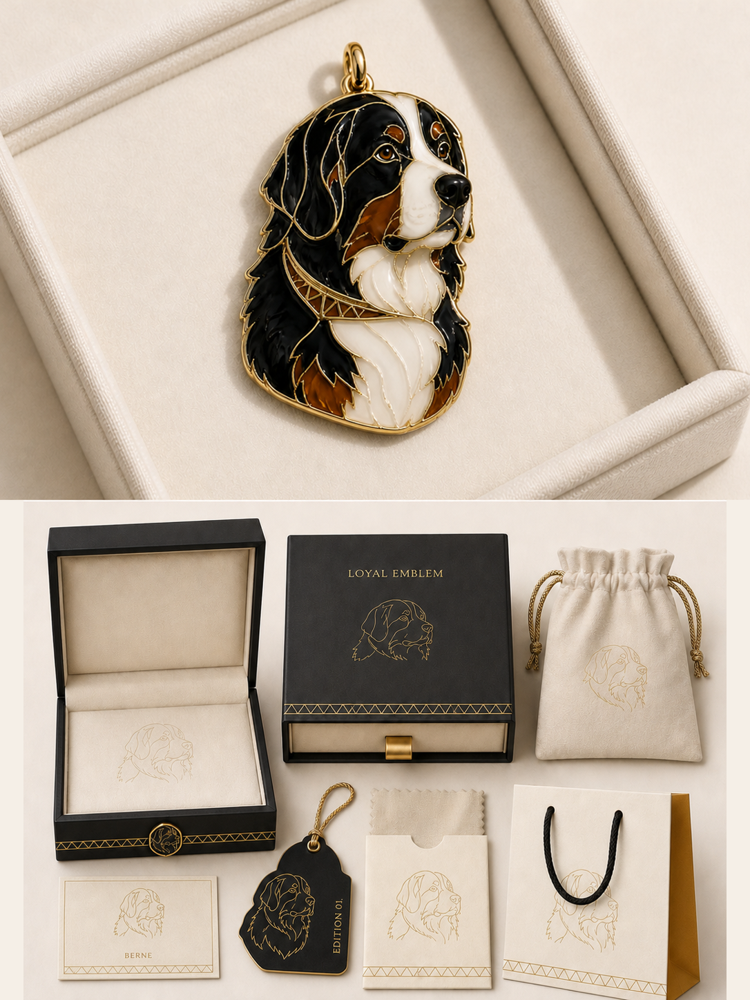
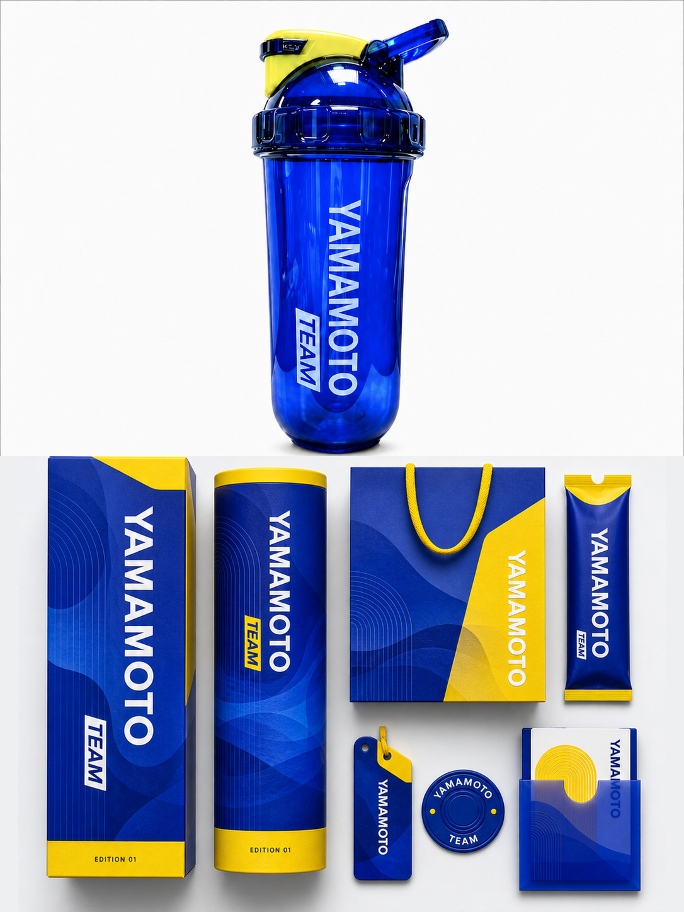

# Silas Photo Packaging Identity

Turn one source photograph into one premium photo-plus-packaging identity poster while preserving the photograph as the visual anchor. This repository contains the reusable Codex Skill, its production prompt, verification scenarios, and authorized generated examples.

## Fixed 3:4 and exact 50:50 contract

Every result is one portrait poster with an exact 3:4 aspect ratio and a single horizontal boundary at the mathematical midpoint.

- The upper half is one continuous, preserved photograph.
- The lower half is one source-derived packaging identity board.
- Both regions have exactly the same pixel height, with no divider, overlap, third region, or element crossing the midpoint.
- For a 1086×1448 result, the upper region is rows `0–723` and the lower region is rows `724–1447`: 724 pixels each.

This split is measured from the decoded output; it is never accepted by visual approximation alone.

## What varies by source

The structure stays fixed, but the lower identity system changes with the photograph. Each source determines the relevant silhouette, contour, posture, relationships, structural lines, material behavior, and color relationships. Those visual genes are translated into five to eight source-appropriate packaging carriers, led by one or two hero packages. User-provided brand, title, supporting text, theme, and palette remain authoritative for the lower half.

## Results

[](examples/dual-sight-poster.png)

[](examples/yamamoto-poster.png)

## Installation

From the repository root, copy the Skill into your personal Codex skills directory:

```sh
skill_dir="${CODEX_HOME:-$HOME/.codex}/skills/silas-photo-packaging-identity"
mkdir -p "$skill_dir"
cp SKILL.md "$skill_dir/"
cp -R agents references "$skill_dir/"
```

Restart Codex after installation so the Skill is discovered.

## Invocation

Invoke it by name and attach or identify each local source photograph:

```text
使用 $silas-photo-packaging-identity 将每张照片制作为独立的 3:4 上下等高包装识别海报。
```

Include any exact brand or title, allowed supporting text, and lower-half theme or palette override in the same request. If no title or brand is supplied, the Skill derives one short, source-specific English main title from the photograph.

## Workflow

1. Inspect each source and identify the subject details that must remain unchanged.
2. Fill the production template in `references/photo-packaging-prompt.zh-CN.md` separately for each source.
3. Generate one versioned 3:4 poster per photograph, preserving the upper photo and deriving the lower packaging system from that source.
4. For a lower-half-only revision, restore the approved upper half pixel-identically and replace only the lower half.
5. Fully decode the result and record dimensions, color mode, midpoint, equal region heights, and whole-file SHA-256 before acceptance. For a lower-half-only revision, also record zero differing upper-half pixels or an identical upper-half crop SHA-256.

## Privacy

This repository contains generated results only and excludes original photos. Do not publish, embed, name, commit, or expose source photographs, screenshots, private local paths, or other original inputs. Add only generated outputs that are explicitly authorized for public use.

## License

The Skill documentation and included generated examples are released under the [MIT License](LICENSE).
